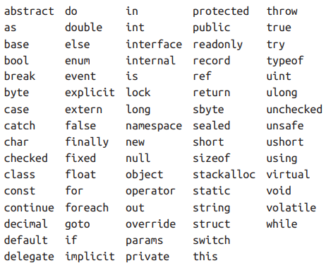

## BAB I (INTRODUCTION)

### CLASS & INTERFACES
Class -> Bisa berisi method / behaviour dan variabel. Tapi tidak bisa multi inheritances
Interfaces -> Hanya berisi method / behaviour. Tapi bisa multi inheritances

### TYPE SAFETY
C# itu strongly typed -> fungsi int dikasih float itu gk bisa
C# itu static typing -> variabel / method harus di declare type / return type nya

### MEMORY MANAGEMENT
C# punya garbage collector buat bersihin memory dari variabel yg gk dipake
C# juga masih punya pointer tapi kalau mau dipake, block code nya ditandai dengan "unsafe"

### CLR BCL dan Runtimes (Framework)

Common Language Runtime itu bisa diakses oleh managed language lain, biasnaya kaya memory handling atau exception handling
C# disebut managed language karena:
<b>Source Code -> Compile -> Intermediate Language (Manage) -> CLR -> Machine Code</b>

CLR ini ada BCL dalemnya, semacam core functionality lah. kaya networking, text processing, dll.

Terakhir ada Runtimes, jadi kalau ngedesain app utk aplikasi tertentu, kaya Web, Mobile, Desktop. Itu ada layer tambahan berupa Runtime atau Framework
Contohnya kaya ASP.NET, MAUI, UWP. Windows Desktop, .NET Frameworks

## BAB II (C# BASIC)

### PERBEDAAN APPS & LIBRARY
C# Source Code -> Compiler -> Application / Library Assembly
- Application : Punya entry point ( Main() )
- Library : Tidak punya entry point, jadi cuma bisa di reference oleh Application atau Library

"dotnet.exe" di Windows utk manage .NET source code dan binaries
- dotnet new -> create project
- dotnet build -> build project (compile)
- dotnet run -> build & run project

### IDENTIFIER & KEYWORD 
Identifier :    Nama yg diberikan programmer untuk variable, method, class, namespace, etc
Keyword :       Nama khusus yang sudah direservasi dan spesial untuk compiler (gk bisa dipake buat Identifier)
                Kalaupun kepaksa pake keyword, pake @ depannya jadi kaya @do, @using etc..

### LITERAL PUNCTUATORS & OPERATORS
Literal :       literaly wkwkw ya nilai kaya 12, 30
Punctuators :   Kaya semicolon sebagai tanda akhir statement
Operators :     = * . () untuk merubah atau menyatukan suatu ekspresi.

### COMMENTS
// Single line comment
/*  Multi
    Line
    Comment */

### TYPE BASICS
Type mendefinisikan blueprint untuk suatu value, kaya:
int x = 3;  int ini predefined type
bisa juga bikin custom type, misal pake class. Tapi kalau mau pake, harus bikin instances nya dulu
Instances ini cuma bisa dibikin kalau si class bukan static, kalau static itu gk bisa misal kaya class Console.
Makanya kalau mau pake method dari class itu, harus pake "nama" Class nya cth: Console.WriteLine().

