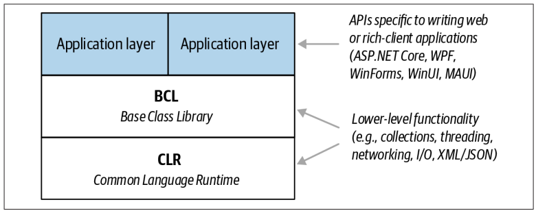

# BAB I

## CLASS & INTERFACES
Class -> Bisa berisi method / behaviour dan variabel. Tapi tidak bisa multi inheritances
Interfaces -> Hanya berisi method / behaviour. Tapi bisa multi inheritances

## TYPE SAFETY
C# itu strongly typed -> fungsi int dikasih float itu gk bisa
C# itu static typing -> variabel / method harus di declare type / return type nya

## MEMORY MANAGEMENT
C# punya garbage collector buat bersihin memory dari variabel yg gk dipake
C# juga masih punya pointer tapi kalau mau dipake, block code nya ditandai dengan "unsafe"

## CLR BCL dan Runtimes (Framework)

Common Language Runtime itu bisa diakses oleh managed language lain, biasnaya kaya memory handling atau exception handling
C# disebut managed language karena:
Source Code -> Compile -> Intermediate Language (Manage) -> CLR -> Machine Code

CLR ini ada BCL dalemnya, semacam core functionality lah. kaya networking, text processing, dll.

Terakhir ada Runtimes, jadi kalau ngedesain app utk aplikasi tertentu, kaya Web, Mobile, Desktop. Itu ada layer tambahan berupa Runtime atau Framework
Contohnya kaya ASP.NET, MAUI, UWP. Windows Desktop, .NET Frameworks